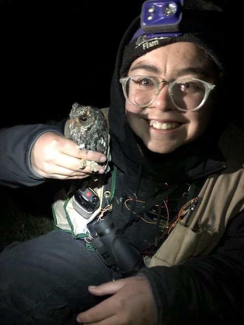

# Who am I?

My name is Jordan and I earned a BA from Colorado College in 2019. I completed an undergraduate thesis about the effects of predation of Flammulated Owls by Red Squirrels entitled [The Rodent Eats the Raptor](https://digitalccbeta.coloradocollege.edu/pid/coccc:31273 "My Thesis!"). While I have experience working with various typees of birds, I am most interested in working with raptors in the area of spatial ecology.

### Current Projects

* Analysis of waterbird surveys in Bahía de Kino, Sonora, Mexico
  * Use of modeling to analyze trends in bird abundance
* Flammulated Owl habitat selection in collaboration with Dr. Brian Linkhart and Kate McGinn
  * Analyzis of long-term data on nest site preferences
  * Utilization of LiDAR dataset to extract biologically relevant characteristics
