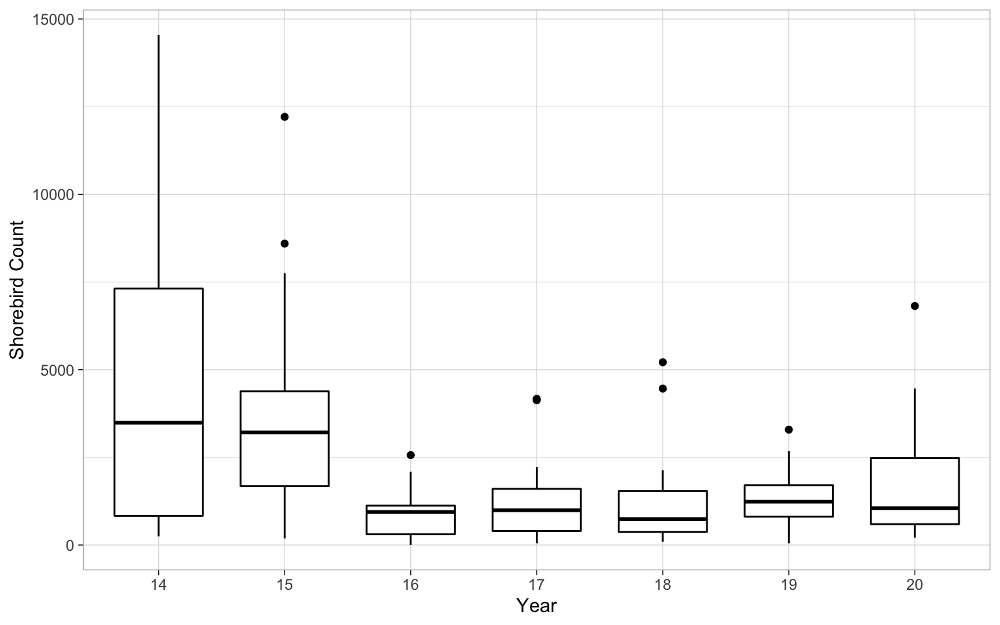
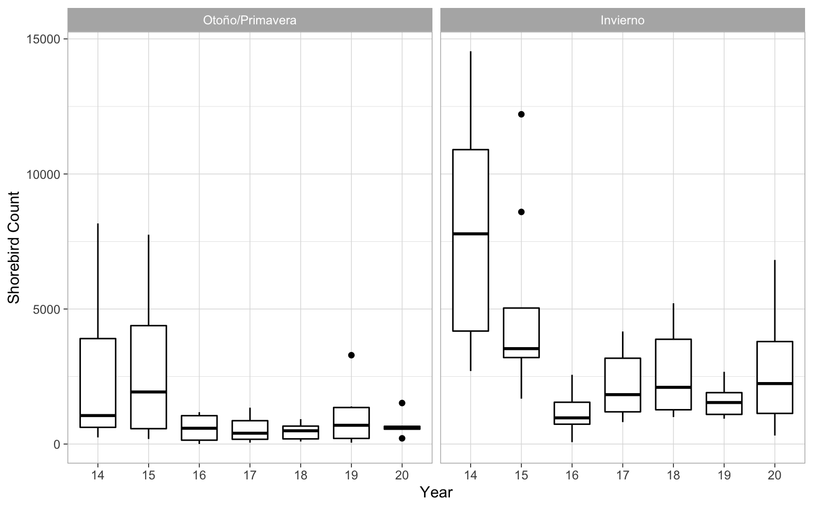
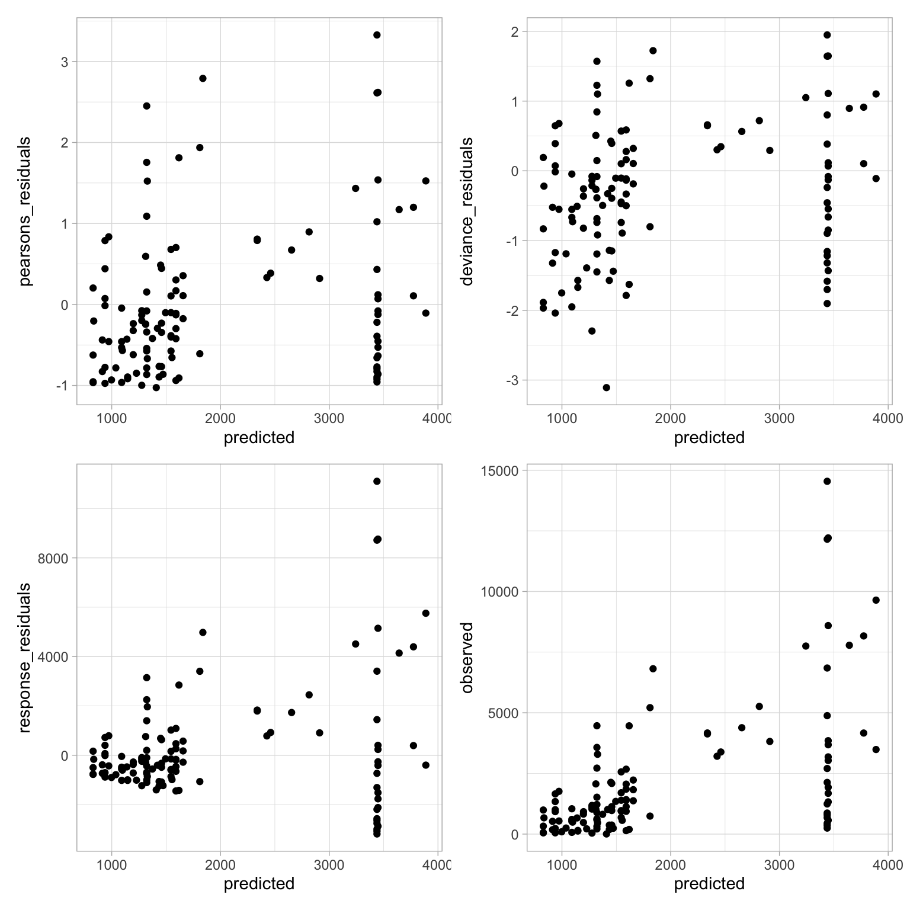
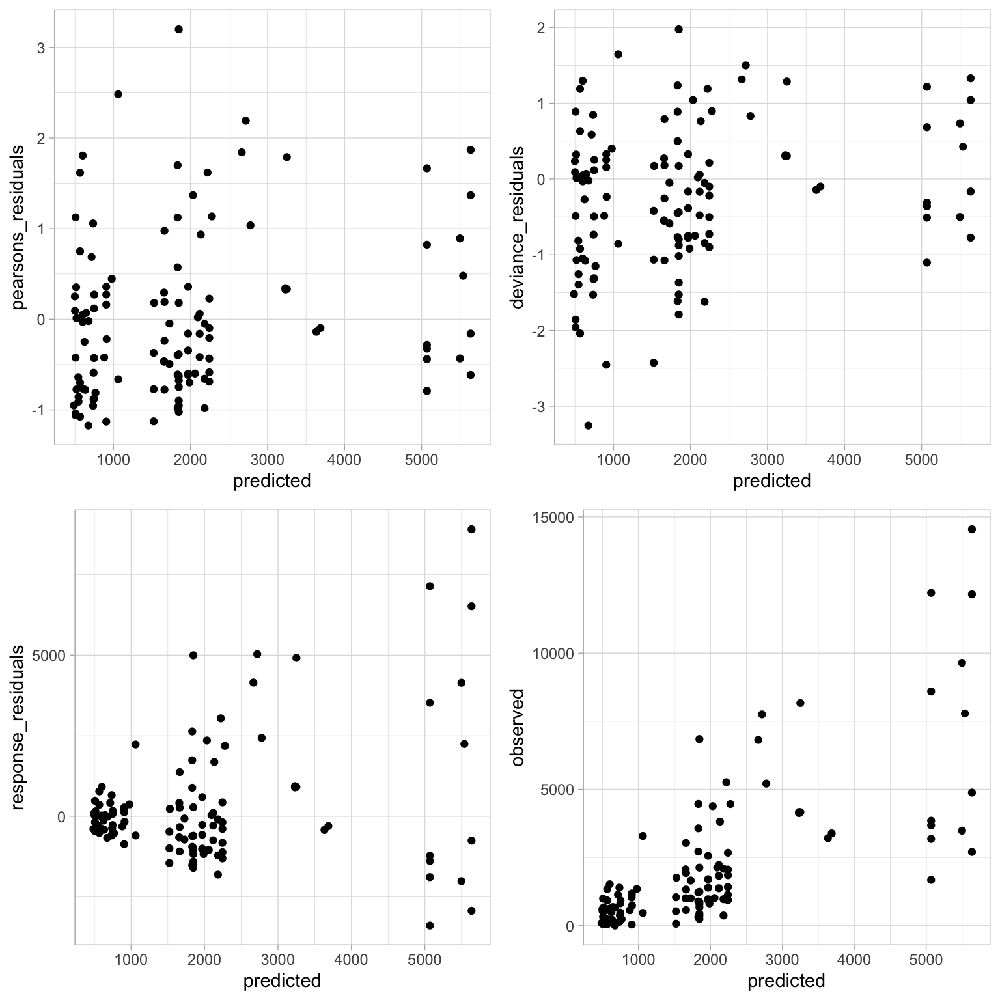
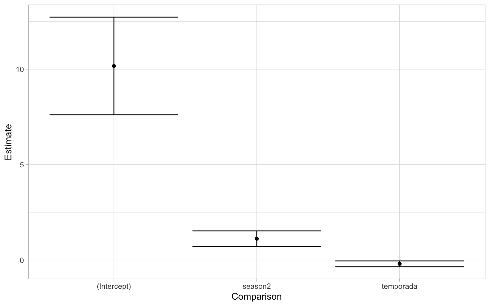
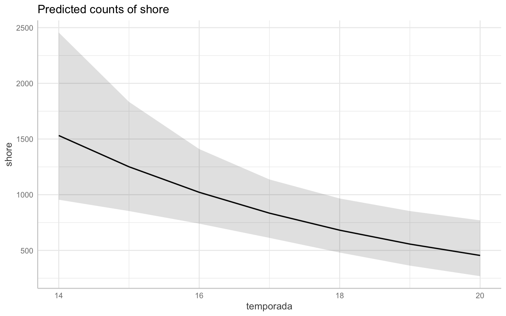
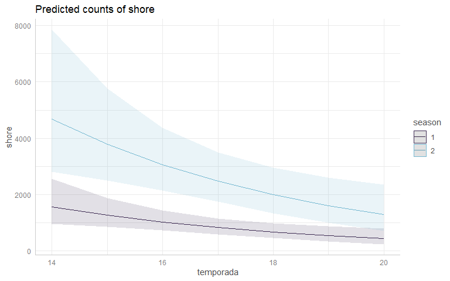
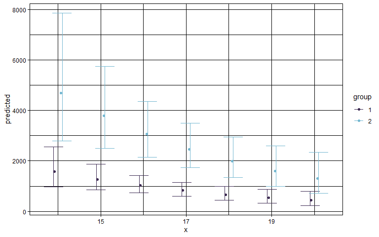
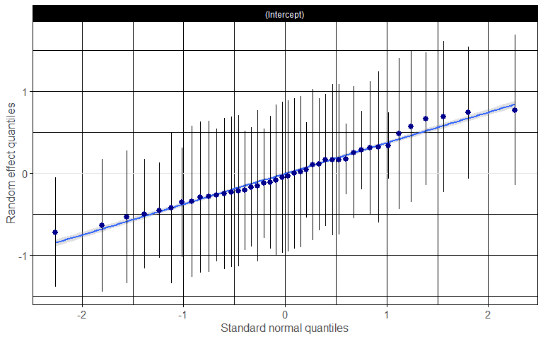
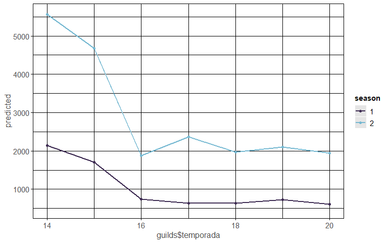

# Introduction

In this document, I'll share some of the steps I've taken to analyze several years of waterbird surveys at Estero La Cruz in Bahía de Kino, Sonora performed by the Prescott College Kino Bay Center Waterbird Monitoring Program. 
This document shows a sample of the work that I've done, using shorebirds as the example, even though I have analyzed the other waterbird guilds.
The goal of this document is to share my attempt to answer the question:
**Has the number of birds at Estero La Cruz changed over time?**

```
## Warning: package 'knitr' was built under R version 3.6.3
```

## Setup

Load required packages:

```r
library(dplyr)
library(ggplot2); theme_set(theme_linedraw())
library(ggpubr)
library(ggeffects)
library(gridExtra)
library(stringr)
library(lme4)
library(MASS)
library(stringr)
library(glmmTMB)
library(lubridate)
library(tidyr)
library(readr)
library(RColorBrewer)
library(MuMIn)
library(patchwork)
library(pscl)
library(numDeriv)
library(multcomp)
library(AICcmodavg)
library(sjPlot)
library(blmeco)
```

## Load Data

All the necessary files should be saved in the working directory.
The files we'll use are counts of birds grouped into guilds for each survey at Estero La Cruz from 2013/14 to the present cycle, with "environment variables" taken at each survey.


```r
guilds <- read_csv("guilds_final.csv",
                   col_types = cols(Date = col_date(format = "%m/%d/%y"),
                                    ciclo = col_character(),
                                    season = col_character()))
```

Here's a sneak peak of the data--as you can see it's set up with each survey effort as a row with every guild as the first columns. After the guilds, we then have the environmental variables.


Table: Preview of Guild Data

Date          shore   gulls_terns   pel_corm   land   waders   waterfowl   Cloud   Temp   Precip
-----------  ------  ------------  ---------  -----  -------  ----------  ------  -----  -------
2013-09-12      867           315        286     12       34           3       5     80        0
2013-09-27     2129          1996        363      4       50           1       2     80        0
2013-10-11      793           587        506      6       18           0       0     72        0
2013-10-25     1243          1508        459      1       57           0       0     75        0
2013-11-07     2704          1473       4527      6       97          98       0     77        0


For the sake of this document, we'll use the group of Shorebirds (in the data as `shore`). 

# NBGLMERs

I decided I wanted to model the data to look for trends over time. A linear model (LM) is one of the simplest forms, as it fits a straright line to a set of data while determing the effect (aka calculating the estimate) of each variable.

There are many forms of modeling and in this instance, I decided to use general linear mixed models aka GLMMs or GLMERs. These types of model are a becoming an increasingly common tool used in biology/ecology/evolution. Given we're working with count data, I determined that a negative binomial distribution was the best fit. And hence, I used NBGLMERs.

Just as a bit of a refresher, in a mixed model, variables can be treated as a fixed effect or a random effect. We'll use the definitions of these effects from Bolker et al. 2009[^1]:

> "Fixed effects: factors whose levels are experimentally determined or whose interest lies in the specific effects of each level, such as effects of covariates, differences among treatments and interactions."

Since we're trying to determine how the number of birds has changed over time, some measure of time is our fixed effect. What we'll be using with our data is the variable "temporada", which is a number corresponding to the yearly work cycle/season that begins in the fall and ends in the summer.

> "Random effects: factors whose levels are sampled from a larger population, or whose interest lies in the variation among them rather than the specific effects of each level. The parameters of random effects are the standard deviations of variation at a particular level (e.g. among experimental blocks). The precise definitions of ‘fixed’ and ‘random’ are controversial; the status of particular variables depends on experimental design and context."

While this is a broad definition, we should also note that there are different kinds of random effects. But we're including a random effect because we want to know the variation that comes from this variable rather than try to estimate and understand the effect at each level within the variable. We want to calculate and take into account the variance of this factor, but we do not necessarily want to quantify/estimate the impact of each individual level of the factor. Given the data we're working with and question we're trying to answer, the random effect that needs to be taken into account in our case is the observer.

[^1]: Bolker, B. M., Brooks, M. E., Clark, C. J., Geange, S. W., Poulsen, J. R., Stevens, M. H. H., & White, J. S. S. (2009). Generalized linear mixed models: a practical guide for ecology and evolution. Trends in ecology & evolution, 24(3), 127-135. [doi:10.1016/j.tree.2008.10.008](https://linkinghub.elsevier.com/retrieve/pii/S0169534709000196)


### But why is observer the random effect?

This is random effect is not because we are using a random sample of a factor but rather because we want to account for random variation among individuals, in our case the observers. With several years of data and different people counting birds over the years, it's pretty easy to imagine that there might be differences in the counts depending on who's doing the counting. We are not trying to estimate the individual effect of each observer (or pair/group of observers) but rather are trying to account for the variation between different observers.

### But what's a Negative Binomial GLMER?

Ok hopefully now you understand a bit better why we're using a mixed model but might still be wondering about this negative binomial thing. Well there are different ways to handle and model data. For example, sometimes you have data that is non-normal so you try things like transforming the data, using non-parametric tests, etc. While these are tools that can be valuable ways to analyze the data, sometimes it doesn't always work. For example, count data (such as what we are working with) can be pretty tricky to work with. For example, if you try to log-transform count data that has 0s, well you can't take the log(0). While people have tried to overcome this, it is sometimes more appropriate to use general linear models that are meant to handle non-normal data. For example, Poisson distributions with a logarithmic link function are commonly used to model count data. But one assumption of this distribution is that the variance is equal to the mean. If your data do not fit this assumption, you have to find ways to deal with this.
For example, with our data, the variance is much greater than the mean. That means that when I tried fitting a model with a Poisson distribution, we had a problem with overdispersion. There are a handful of ways to deal with this problem of overdispersion. In my initial exploratory modeling, I found that the negative binomial distribution was most appropriate as it best fit the data as we no longer had a problem with overdispersion.
So--the models I decided to use are negative binomial general linear mixed models.

# Shorebirds

Like I mentioned above, we'll use shorebirds as the example if the work that I've done. Shorebirds are made up of a range of birds- from small plovers to larger dowitchers. v

## Preliminary Plotting

We'll start off by making a couple graphs to get an idea of the data we're working with. Some things to note and **keep in mind** about the data are two very important things. 
1. "temporada" is essentially year. But it is not named "year" because it's the yearly work cycle/season. That translate to the year "14" is actually fall 2013-summer 2014, etc.
2. "season" is a categorical variable that has two levels: 1=fall/spring and 2=winter.

*With the effect of season, I decided to drop summer from the grouping because there were few surveys in the summer months. I decided to combine the fall and spring seasons, as in my exploratory work I determined that the seasons we're similar enough to be considered one. Ecologically, this also makes sense given that both periods are a time in which birds are moving around and migrating.*

<!-- --><!-- -->

It's always good to take a look at the date. For example here you can see that there's quite a bit of variability in the counts in the years, particularly our first year that is the 2013-2014 season.

So next I ran the model:

```r
glmernb.shore <- glmer.nb(shore ~ temporada + (1|obs), data=guilds)
dispersion_glmer(glmernb.shore)          ##test for overdisperion
```

```
## [1] 1.070528
```

```r
summary(glmernb.shore)                   ##check model summary
```

```
## Generalized linear mixed model fit by maximum likelihood (Laplace
##   Approximation) [glmerMod]
##  Family: Negative Binomial(1.062)  ( log )
## Formula: shore ~ temporada + (1 | obs)
##    Data: guilds
## 
##      AIC      BIC   logLik deviance df.resid 
##   1955.3   1966.2   -973.6   1947.3      109 
## 
## Scaled residuals: 
##     Min      1Q  Median      3Q     Max 
## -1.0262 -0.6600 -0.2132  0.3616  3.3033 
## 
## Random effects:
##  Groups Name        Variance Std.Dev.
##  obs    (Intercept) 0.3017   0.5493  
## Number of obs: 113, groups:  obs, 42
## 
## Fixed effects:
##             Estimate Std. Error z value Pr(>|z|)    
## (Intercept) 10.50298    1.26709   8.289   <2e-16 ***
## temporada   -0.18762    0.07616  -2.463   0.0138 *  
## ---
## Signif. codes:  0 '***' 0.001 '**' 0.01 '*' 0.05 '.' 0.1 ' ' 1
## 
## Correlation of Fixed Effects:
##           (Intr)
## temporada -0.991
```

Above I included a test for overdispersion since that was a big concern throughout my initial efforts in trying to model the data. As you can see, the ratio of the deviation to DF (of the residuals) is fairly close to 1. The P-value of the Chi-squared comparing the residual deviance and degrees of freedom to a chi-square distribution is pretty close to 1, which is good. This means we are not dealing with overdispersion.

Above you can also look over the summary of the model. Just from an initial look at this model summary, it looks like there is a significant decline in the abundance of shorebirds over time. It also appears, as expected, that there is a significant increase in the abundance of birds in the winter months in comparison to the rest of the year. Before we saying anything more, let's do a handful of other steps to check the model and make sure this will be our final model. *Stay tuned* below first for some model selection work and later some further interpretation. 

## Residuals

Let's plot and take a look at our residuals--always an important step in verifying the model fit. 
I can tell you right now that these are the best I've been able to do thus far. 


```r
##put all the imporant things into a data frame
resid_shore<-data.frame(
    pearsons_residuals=resid(glmernb.shore,type="pearson"),
    deviance_residuals=resid(glmernb.shore,type="deviance"),
    response_residuals=guilds$shore-predict(glmernb.shore,type = "response"),
    predicted=predict(glmernb.shore,type = "response"),
    observed=guilds$shore)

##plot predictions and resids
ggplot(resid_shore,aes(x=predicted,y=pearsons_residuals))+
  geom_point() +
  ggplot(resid_shore,aes(x=predicted,y=deviance_residuals))+
  geom_point()+
  ggplot(resid_shore,aes(x=predicted,y=response_residuals))+
  geom_point()+
  ggplot(resid_shore,aes(x=predicted,y=observed))+ geom_point()
```

<!-- -->

While this isn't necessarily the best looking set of residual graphs, I'll admit that in all the work I've done, this is decent.

## Model Selection 

Here I'll show some of the steps I took when trying to select a model. The model above is a pretty ok fit, but there are some other things I could include in the model. To make sure that the first model above is indeed the best for our data, we'll go through a series of steps to gain some confidence.
It's not quite as pretty as using something like the `dredge()` function from the `MuMln` package (I couldn't get it to work with a `glmer.nb()` model), but as far as I understand model selection, we can do some of the same things but one step at a time.

First we'll make a null model and compare it to our first simple model that we made that includes just the year.


```r
null.shore <- glmer.nb(shore ~ 1 + (1|obs), data=guilds)
anova(null.shore, glmernb.shore)       ##compare models in ANOVA table
```

```
## Data: guilds
## Models:
## null.shore: shore ~ 1 + (1 | obs)
## glmernb.shore: shore ~ temporada + (1 | obs)
##               npar    AIC    BIC  logLik deviance  Chisq Df Pr(>Chisq)  
## null.shore       3 1958.4 1966.6 -976.19   1952.4                       
## glmernb.shore    4 1955.3 1966.2 -973.64   1947.3 5.1006  1    0.02392 *
## ---
## Signif. codes:  0 '***' 0.001 '**' 0.01 '*' 0.05 '.' 0.1 ' ' 1
```

Since there is a significant difference, this means we can reject the null model and accept the simple negative binomial mixed model as a better fit to the data. I also feel good about that given the AICc/BIC are slightly lower.

Now let's add in some other potential variables that would affect the presence of birds, in this case the season and the tide! Here season is split into 1. Here tide is split into two variables- tide height (low/mid/high) and tide direction (rising/slack/falling).


```r
##add season(o estación)
glmernb.shore1 <- glmer.nb(shore ~ temporada + season + (1|obs), data=guilds)

##add tide height?
glmernb.shore2 <- glmer.nb(shore ~ temporada + season + tide_height + (1|obs),
                           data=guilds)
##add tide dir?
glmernb.shore3 <- glmer.nb(shore ~ temporada + season + tide_dir + (1|obs),
                           data=guilds)
##add both tide variables?
glmernb.shore4 <- glmer.nb(shore ~ temporada + season + tide_height + tide_dir +
                             (1|obs), data=guilds)
```

We can make a neat model selection table based on information selection criteria. Here we will use the second order AIC (AICc) for comparison. For more about model selection based on information criteria, Burnham and Anderson 2002[^2] is a classic article on the topic. Burnham and Anderson have also written many different articles and even books on the topic of model selection.

For the model names, I abbreviated the names into "modX" so note that "mod" = "glmernb.shore", "mod1" = "glmernb.shore1", "mod2" = "glmernb.shore2", etc...

[^2]: Anderson, D. R., & Burnham, K. P. (2002). Avoiding pitfalls when using information-theoretic methods. The Journal of Wildlife Management, 912-918. [doi: 10.2307/3803155](https://www.jstor.org/stable/3803155)


```r
shore.cand <- list(null.shore, glmernb.shore, glmernb.shore1, glmernb.shore2, 
                   glmernb.shore3, glmernb.shore4)
mod.names <- list(c("null", "mod", "mod1", "mod2", "mod3","mod4"))
aictab(shore.cand, mod.names)       ##this exports our clean table below
```

```
## 
## Model selection based on AICc:
## 
##       K    AICc Delta_AICc AICcWt Cum.Wt      LL
## mod1  5 1928.79       0.00   0.40   0.40 -959.12
## mod3  7 1929.16       0.37   0.33   0.74 -957.05
## mod2  8 1930.45       1.65   0.18   0.91 -956.53
## mod4 10 1931.81       3.02   0.09   1.00 -954.83
## mod   4 1955.65      26.86   0.00   1.00 -973.64
## null  3 1958.60      29.81   0.00   1.00 -976.19
```

From this, our `glmernb.shore1` model seemingly performs the best. 

Let's do another check by comparing increasingly complex models using ANOVAs. Again, if the Chi-squared value is significant, that means that the model is a better fit. 
We will set up comparisons between our simplest model (glmernb.shore) and each of the increasingly complex models. While we can use the code to set up single comparisons between models (ie. `anova(mod1, mod2)`) we can also combine it into one line of code such as `anova(mod, mod1, mod2, ...)` and we will get a table that compares our simplest model (mod1) with the rest of the models. 


                  npar        AIC        BIC      logLik   deviance       Chisq   Df   Pr(>Chisq)
---------------  -----  ---------  ---------  ----------  ---------  ----------  ---  -----------
glmernb.shore        4   1955.278   1966.188   -973.6392   1947.278          NA   NA           NA
glmernb.shore1       5   1928.231   1941.868   -959.1156   1918.231   29.047155    1    0.0000001
glmernb.shore3       7   1928.096   1947.187   -957.0479   1914.096    4.135420    2    0.1264751
glmernb.shore2       8   1929.062   1950.881   -956.5311   1913.062    1.033537    1    0.3093293
glmernb.shore4      10   1929.656   1956.930   -954.8280   1909.656    3.406285    2    0.1821103


Now let's try it again, but starting with our best model so far, `glmernb.shore1`. 


                  npar        AIC        BIC      logLik   deviance      Chisq   Df   Pr(>Chisq)
---------------  -----  ---------  ---------  ----------  ---------  ---------  ---  -----------
glmernb.shore1       5   1928.231   1941.868   -959.1156   1918.231         NA   NA           NA
glmernb.shore3       7   1928.096   1947.187   -957.0479   1914.096   4.135420    2    0.1264751
glmernb.shore2       8   1929.062   1950.881   -956.5311   1913.062   1.033537    1    0.3093293
glmernb.shore4      10   1929.656   1956.930   -954.8280   1909.656   3.406285    2    0.1821103


It looks like our best model was a good choice and we feel good about the `glmernb.shore1` model and we can use it with confidence. That's because what each of these tables show, is that with adding in the height and/or direction of the tide, we do not get a better fitting model. That means we should stick to our simple model that has the effect of work cycle/year and season, as it is the best fit.

Another potential approach to model selection would be to average the models. But rather than follow more complicated steps to do that, I think it's OK to stick with this process of selecting and sticking with the best and most simple model.

## Calculating R^2

Now that we have selected a model, one interesting piece of information about the model is checking the R^2 value. While this measure is commonly used in lms and glms it can be applied to mixed models. Here the function will calculate the R^2 values taking into account only the fixed effects (marginal) as well as all effects (conditional) using 3 different methods.
Here's the explanation taken from the `help("r.squaredGLMM")`: 

> Marginal R_GLMM² represents the variance explained by the fixed effects, and is defined as: $$R_GLMM(m)² = (σ_f²) / (σ_f² + σ_α² + σ_ε²)$$ 
Conditional R_GLMM² is interpreted as a variance explained by the entire model, including both fixed and random effects, and is calculated according to the equation: $$R_GLMM(c)² = (σ_f² + σ_α²) / (σ_f² + σ_α² + σ_ε²)$$ where σ_f² is the variance of the fixed effect components, σ_α² is the variance of the random effects, and σ_ε² is the “observation-level” variance.

So with that we can make a table of these values:

```r
(r.squaredGLMM(glmernb.shore1))
```

```
##                 R2m       R2c
## delta     0.2803544 0.4955451
## lognormal 0.3210872 0.5675430
## trigamma  0.2281495 0.4032694
```

From the this, it looks like our model does a pretty decent job of fitting the data and explaining the variance. Given we're modeling change over time and not taking into account other environmental variables that are likely affecting the presence/absence/abundance of birds, I feel okay about believing this model. 

## Check Residuals

We'll run more or less the same code as we used above.

<!-- -->

Again, it looks more or less the same as before. Our residuals aren't perfectly randomly distributed but I'm not sure what I could do at this point to get a better fit. Given the process to get to this model, I think it's acceptable for the sake of this analysis. 

## Plotting Model Predictions

Now it's time to look at our model predictions. One of the most important aspects of a regression are the estimates of each variable in the model. Since we're working with negative binomial models, there is a log link meaning the estimates of each effect need to be log transformed. We can do that easily by using R as a fancy calculator. Before we do that, let's take a quick look at the different estimates of the model.

<!-- -->

The first thing you might notice is that the intercept is very high- yes but it's not as important. If we think about the data we're modeling, there are counts of shorebirds in the thousands. Also recall that in the first year of data (2013-2014 season), there is a very high degree of variability.
What we really want to pay more attention to are the estimates of two fixed effects of the model. Just by looking at this graph, the effect of season is a positive increase while that of temporada(which again is the year/cycle) is negative.
If you recall from the summary output of the model the estimate of the variable temporada was: -0.2139745. To translate that into normal terms, as the year/cycle changes by 1, the change in shorebird abundance is multiplied by a factor of 0.8073726. This can be interpreted into that "the abundance of shorebirds is declining by 19.2627394% each year." 
One way we can visualize this is by plotting the predicted values on a graph. We can plot the overall trend of the model. Note that this will back-transform the predicted values to the original scale of our response variable.  

<!-- -->

However, we know there are differences between the season and that there was a significant effect in the model. From the model estimate of that variable, we can say winter season sees an increase of 298.13879% in the number of shorebirds in comparison to the rest of the year. 
Knowing that the difference is so great, let's take a look at the same graph as above, but grouped by season. 
*Recall that the seasons are split into 1: Fall/Sping and 2: Winter.*

<!-- --><!-- -->
    
*Note that both graphs above are the same data, just plotted differently.*    
 
In both graphs, the seasons are split into 1 (Fall/Spring--the migration seasons) in purple and 2 (Winter) in blue. These colors will be consistent throughout the rest of this document. 
This shows that while shorebird abundance is declining in both seasons, it's clear that the decline is more pronounced in the winter--we can visually see this as the slope of the line is steeper. My initial thought is that this could potentially be due a decline in the migratory species overwintering, so it would be a good idea to look further into the migratory species.

Plot the random effects:


```r
set_theme(base = theme_linedraw())
plot_model(glmernb.shore1, type="re", colors = "ipsum", vline.color = "red")
```

<!-- -->

The first plot shows the random effects. The red line indicates no effect. The blue indicates a positive effect while purple is negative.


Now a "diagnostic" plot, which from the `help("plot_model")`:
> For **generalized linear mixed models**, returns the QQ-plot for random effects.

This means a diagnostic plot will give us a qq plot. Keep in mind that qqplots are used to check for normality.

```r
plot_model(glmernb.shore1, type="diag")
```

```
## $obs
```

```
## `geom_smooth()` using formula 'y ~ x'
```

<!-- -->
This plot above, as mentioned, is a qqplot. If the data fits well along the line, we're happy with the data. If there are outliers or lots of points that stray far away from the line, then we might want to re-evaluate. From looking at this plot, I think we're OK.
ust to be a bit more confident, we will also check our residuals:


```r
##show it as connected line
shore_resids <- cbind(resid_shore1, guilds$season)
shore_resids <- cbind(shore_resids, guilds$temporada)
shore_resids$temporada <- shore_resids$`guilds$temporada`
shore_resids$season <- shore_resids$`guilds$season`

ggplot(shore_resids, aes(guilds$temporada, predicted, colour = season)) + 
  scale_color_manual(values = c("#3f2d54", "#75b8d1")) +
  stat_summary(geom="smooth", fun.data=mean_cl_normal, width=0.1, conf.int=0.95) +
  stat_summary(geom="line", fun=mean, linetype="dashed") +
  stat_summary(geom="point", fun=mean) 
```

<!-- -->


# Conclusion

To sum up some of this information, we can make a clean model summary table. 


```r
tab_model(glmernb.shore1, 
          dv.labels = c("Shorebirds"),
          string.ci = "Conf. Int (95%)", 
          string.p = "P-Value", pred.labels = c("Intercept", "Year", "Season"))
```

<table style="border-collapse:collapse; border:none;">
<tr>
<th style="border-top: double; text-align:center; font-style:normal; font-weight:bold; padding:0.2cm;  text-align:left; ">&nbsp;</th>
<th colspan="3" style="border-top: double; text-align:center; font-style:normal; font-weight:bold; padding:0.2cm; ">Shorebirds</th>
</tr>
<tr>
<td style=" text-align:center; border-bottom:1px solid; font-style:italic; font-weight:normal;  text-align:left; ">Predictors</td>
<td style=" text-align:center; border-bottom:1px solid; font-style:italic; font-weight:normal;  ">Incidence Rate Ratios</td>
<td style=" text-align:center; border-bottom:1px solid; font-style:italic; font-weight:normal;  ">Conf. Int (95%)</td>
<td style=" text-align:center; border-bottom:1px solid; font-style:italic; font-weight:normal;  ">P-Value</td>
</tr>
<tr>
<td style=" padding:0.2cm; text-align:left; vertical-align:top; text-align:left; ">Intercept</td>
<td style=" padding:0.2cm; text-align:left; vertical-align:top; text-align:center;  ">31436.96</td>
<td style=" padding:0.2cm; text-align:left; vertical-align:top; text-align:center;  ">2818.76&nbsp;&ndash;&nbsp;350609.27</td>
<td style=" padding:0.2cm; text-align:left; vertical-align:top; text-align:center;  "><strong>&lt;0.001</td>
</tr>
<tr>
<td style=" padding:0.2cm; text-align:left; vertical-align:top; text-align:left; ">Year</td>
<td style=" padding:0.2cm; text-align:left; vertical-align:top; text-align:center;  ">0.81</td>
<td style=" padding:0.2cm; text-align:left; vertical-align:top; text-align:center;  ">0.70&nbsp;&ndash;&nbsp;0.93</td>
<td style=" padding:0.2cm; text-align:left; vertical-align:top; text-align:center;  "><strong>0.004</strong></td>
</tr>
<tr>
<td style=" padding:0.2cm; text-align:left; vertical-align:top; text-align:left; ">Season</td>
<td style=" padding:0.2cm; text-align:left; vertical-align:top; text-align:center;  ">2.98</td>
<td style=" padding:0.2cm; text-align:left; vertical-align:top; text-align:center;  ">2.06&nbsp;&ndash;&nbsp;4.32</td>
<td style=" padding:0.2cm; text-align:left; vertical-align:top; text-align:center;  "><strong>&lt;0.001</td>
</tr>
<tr>
<td colspan="4" style="font-weight:bold; text-align:left; padding-top:.8em;">Random Effects</td>
</tr>

<tr>
<td style=" padding:0.2cm; text-align:left; vertical-align:top; text-align:left; padding-top:0.1cm; padding-bottom:0.1cm;">&sigma;<sup>2</sup></td>
<td style=" padding:0.2cm; text-align:left; vertical-align:top; padding-top:0.1cm; padding-bottom:0.1cm; text-align:left;" colspan="3">0.55</td>

<tr>
<td style=" padding:0.2cm; text-align:left; vertical-align:top; text-align:left; padding-top:0.1cm; padding-bottom:0.1cm;">&tau;<sub>00</sub> <sub>obs</sub></td>
<td style=" padding:0.2cm; text-align:left; vertical-align:top; padding-top:0.1cm; padding-bottom:0.1cm; text-align:left;" colspan="3">0.32</td>

<tr>
<td style=" padding:0.2cm; text-align:left; vertical-align:top; text-align:left; padding-top:0.1cm; padding-bottom:0.1cm;">ICC</td>
<td style=" padding:0.2cm; text-align:left; vertical-align:top; padding-top:0.1cm; padding-bottom:0.1cm; text-align:left;" colspan="3">0.36</td>

<tr>
<td style=" padding:0.2cm; text-align:left; vertical-align:top; text-align:left; padding-top:0.1cm; padding-bottom:0.1cm;">N <sub>obs</sub></td>
<td style=" padding:0.2cm; text-align:left; vertical-align:top; padding-top:0.1cm; padding-bottom:0.1cm; text-align:left;" colspan="3">42</td>
<tr>
<td style=" padding:0.2cm; text-align:left; vertical-align:top; text-align:left; padding-top:0.1cm; padding-bottom:0.1cm; border-top:1px solid;">Observations</td>
<td style=" padding:0.2cm; text-align:left; vertical-align:top; padding-top:0.1cm; padding-bottom:0.1cm; text-align:left; border-top:1px solid;" colspan="3">113</td>
</tr>
<tr>
<td style=" padding:0.2cm; text-align:left; vertical-align:top; text-align:left; padding-top:0.1cm; padding-bottom:0.1cm;">Marginal R<sup>2</sup> / Conditional R<sup>2</sup></td>
<td style=" padding:0.2cm; text-align:left; vertical-align:top; padding-top:0.1cm; padding-bottom:0.1cm; text-align:left;" colspan="3">0.321 / 0.568</td>
</tr>

</table>

So what can we gather from this table? As mentioned, we saw a dramatic increase in the number of birds in the winter in comparison to the combined fall/spring category. This makes a lot of sense ecologically given the number of birds that come to overwinter in the region. Knowing that many species included in the guild are migrants, we can say that could be due to the influx of migrants.

Another trend we saw in the shorebird guild is a pretty drastic decline. While it is a sad thing to see in our data, it is not entirely unsurprising. There exists a multitude of articles that discuss at length declines in birds and other species, as well as the heightened extinction rates during this age of the anthropocene. 

