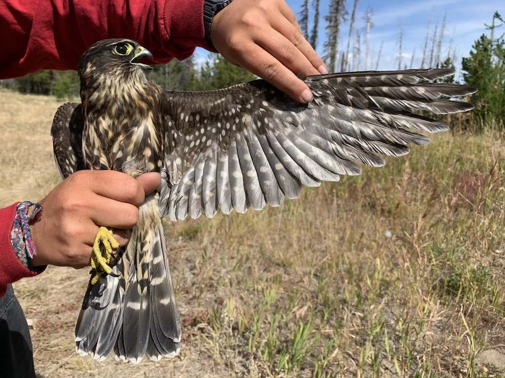

I am an avian ecologist particularly interested in all things quantitative and spatial! 
I completed my MS in Fish, Wildlife and Conservation Ecology at New Mexico State University in May 2024, where I studied the effects of prairie dog colony characteristics and landscape patterns on Burrowing Owl nest survival and productivity.

I have previously worked with small owls, diurnal raptors, waterbirds and songbirds. I have experience performing a variety of statistical analyses on various longitudinal data sets, as well as extensive experience working with GIS. 

Click the tabs at the top of the page to learn more about me or check out some of the different work in R I've done and/or presented to others! 

