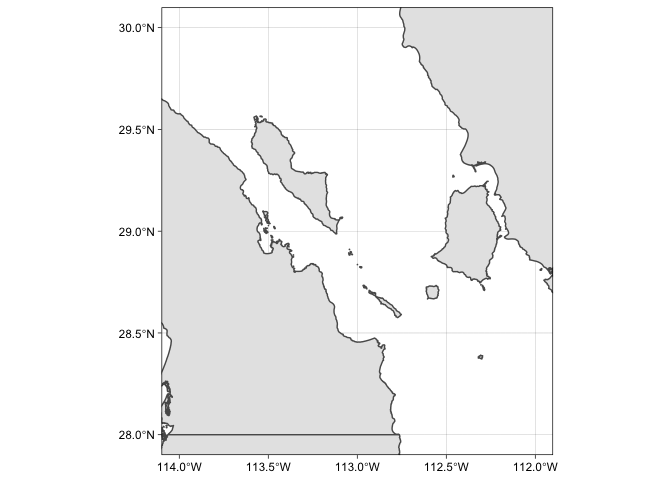
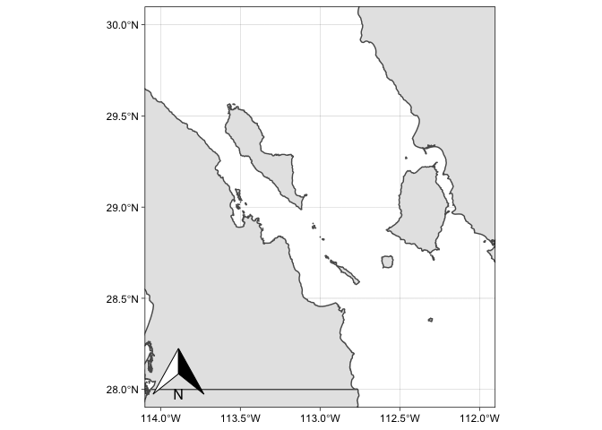
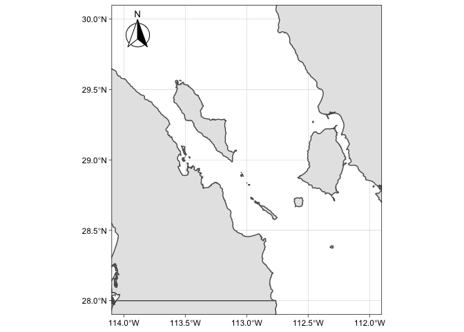
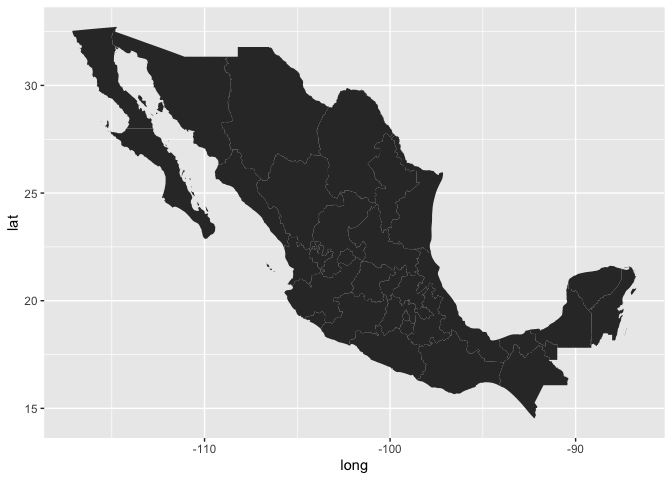
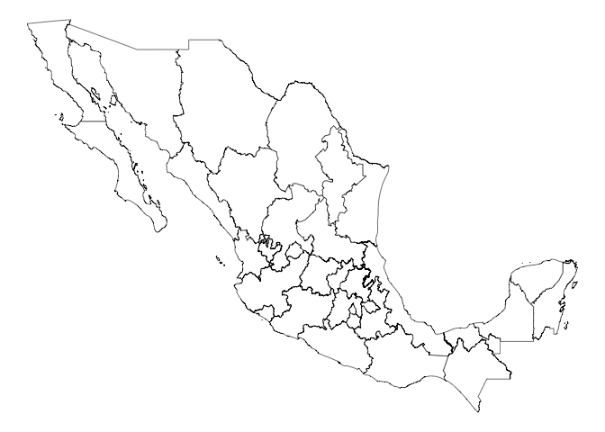
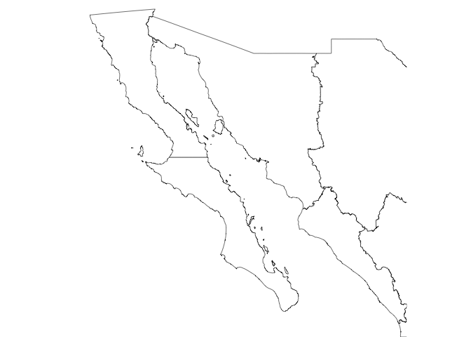
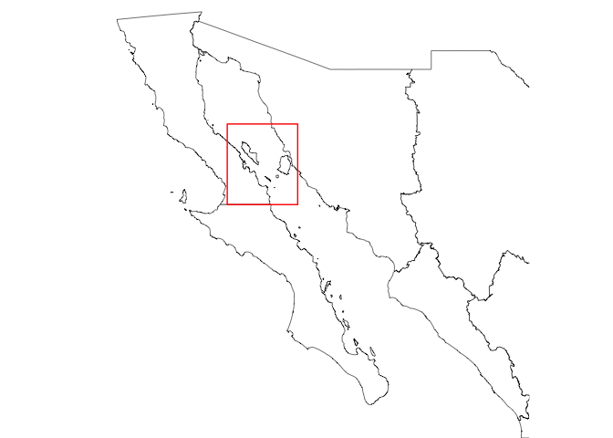
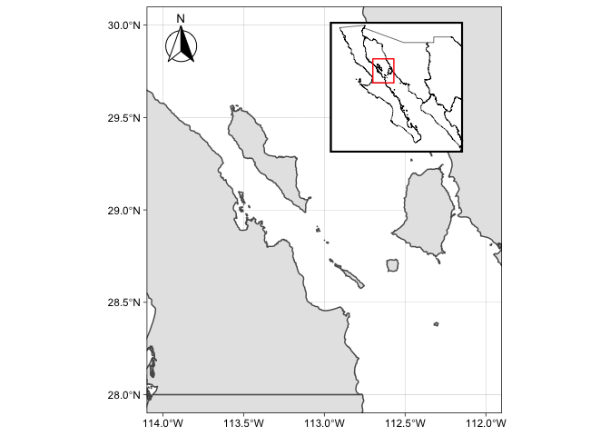

GSO Workshop
================

In April 2021, I co-presented a workshop on working with spatial data in
R to the NMSU Fish, Wildlife and Conservation Ecology Graduate Student
Organization (GSO). One of the topics I presented on was how to make a 
simple inset map with R. I have adapted my original r script into a markdown
document for this site. 

## Packages

``` r
library(sf)
```

    ## Linking to GEOS 3.8.1, GDAL 3.2.1, PROJ 7.2.1

``` r
library(tidyverse)
```

    ## ── Attaching packages ─────────────────────────────────────── tidyverse 1.3.1 ──

    ## ✓ ggplot2 3.3.4     ✓ purrr   0.3.4
    ## ✓ tibble  3.1.2     ✓ dplyr   1.0.7
    ## ✓ tidyr   1.1.3     ✓ stringr 1.4.0
    ## ✓ readr   1.4.0     ✓ forcats 0.5.1

    ## ── Conflicts ────────────────────────────────────────── tidyverse_conflicts() ──
    ## x dplyr::filter() masks stats::filter()
    ## x dplyr::lag()    masks stats::lag()

``` r
library(rgdal)
```

    ## Loading required package: sp

    ## rgdal: version: 1.5-23, (SVN revision 1121)
    ## Geospatial Data Abstraction Library extensions to R successfully loaded
    ## Loaded GDAL runtime: GDAL 3.2.1, released 2020/12/29
    ## Path to GDAL shared files: /Library/Frameworks/R.framework/Versions/4.0/Resources/library/rgdal/gdal
    ## GDAL binary built with GEOS: TRUE 
    ## Loaded PROJ runtime: Rel. 7.2.1, January 1st, 2021, [PJ_VERSION: 721]
    ## Path to PROJ shared files: /Library/Frameworks/R.framework/Versions/4.0/Resources/library/rgdal/proj
    ## PROJ CDN enabled: FALSE
    ## Linking to sp version:1.4-5
    ## To mute warnings of possible GDAL/OSR exportToProj4() degradation,
    ## use options("rgdal_show_exportToProj4_warnings"="none") before loading rgdal.
    ## Overwritten PROJ_LIB was /Library/Frameworks/R.framework/Versions/4.0/Resources/library/rgdal/proj

``` r
library(maps) ##not used, but has some world map data in it
```

    ## 
    ## Attaching package: 'maps'

    ## The following object is masked from 'package:purrr':
    ## 
    ##     map

``` r
library(mxmaps)
library(cowplot)
library(ggspatial)
```

## Building the Focal Map

First we can load the data by directly reading a shapefile (saved in the
working directory) and bringing it into R as a SF object. The shapefile
includes the states of Mexico. We’ll want to filter to only include the
Northwestern states, then “zoom” into our focal area.

``` r
estados <- read_sf("dest_2010gw/dest_2010gw.shp")

## filter out the data so we can plot a focal area (NW Mexican states) 
area <- estados %>% filter(ENTIDAD == "SONORA" | ENTIDAD == "SINALOA" | 
                             ENTIDAD == "BAJA CALIFORNIA" | ENTIDAD == "BAJA CALIFORNIA SUR")

## since the data is an SF object, we can easily make a simple map of it
ggplot(area) + geom_sf(aes()) + theme_linedraw()
```

<!-- -->

Lets “zoom” into the focal area of the Midriff Islands Region, by
setting limits on our axes using lat/long coordinates.

``` r
ggplot(area) + geom_sf(aes()) + theme_linedraw() + coord_sf(xlim = c(-114, -112), 
                                                            ylim = c(28, 30), 
                                                            expand = TRUE) 
```

<!-- -->

Since ggplot gives us nice axes/gridlines that functions as a clean
graticule, we won’t incldue a scale bar. But lets add a north arrow.

``` r
ggplot(area) + geom_sf(aes()) + theme_linedraw() + coord_sf(xlim = c(-114, -112), 
                                                            ylim = c(28, 30), 
                                                            expand = TRUE) +
  annotation_north_arrow() 
```

<!-- -->

This doesn’t look too aesthetically pleasing, but luckily we can fix
that by playing with the the style and the location of the north arrow.
Note that the location can be specified as top left (“tl”), bottom left
(“bl”), etc.

``` r
ggplot(area) + geom_sf(aes()) + theme_linedraw() + coord_sf(xlim = c(-114, -112), 
                                                            ylim = c(28, 30), 
                                                            expand = TRUE) +
  annotation_north_arrow(location = "tl", style = north_arrow_fancy_orienteering()) 
```

<!-- -->

``` r
## this is looking pretty good so lets save this as an object so that we can add the inset
p1 <- ggplot(area) + geom_sf(aes()) + theme_linedraw() + coord_sf(xlim = c(-114, -112), 
                                                                  ylim = c(28, 30), 
                                                                  expand = TRUE) +
  annotation_north_arrow(location = "tl", style = north_arrow_fancy_orienteering())
```

## Building the inset map

There are lots of packages that come with different spatial data. Rather
than use the same shapefile, we can use the package `mxmaps` that has
some simple map data of Mexico to create our map in a different way.

``` r
ggplot(mxstate.map, aes(long, lat, group=group)) + geom_polygon()
```

<!-- -->

We can now begin to change the aesthetics such as the fill, outline
thickness and theme of the map. The void theme is the best choice for
our inset map, as we can also easily add layers of aesthetics that we
want or don’t want.

``` r
ggplot(mxstate.map, aes(long, lat, group=group)) +
  geom_polygon(fill = "white", color = "black", size = .2) + theme_void()
```

<!-- -->

We don’t want the whole map of mexico, we just want to show the
northwest area of the country. Once again we set set limits to the x and
y axes using coodinates to “zoom” into an area.

``` r
ggplot(mxstate.map, aes(long, lat, group=group)) +
  geom_polygon(fill = "white", color = "black", size = .2) + theme_void() + 
  coord_map(ylim=c(22.5,32.5), xlim=c(-117.5, -106))
```

<!-- -->

To draw a box over the map area to highlight the area of the main map,
we will add a rectangle using the `annotate` function, specifying the
limits using the coordinates we used above. We can also specify the
color of the box- here we’ll use red so that it pops.

``` r
ggplot(mxstate.map, aes(long, lat, group=group)) +
  geom_polygon(fill = "white", color = "black", size = .2) + theme_void() + 
  coord_map(ylim=c(22.5,32.5), xlim=c(-117.5, -106)) + 
  annotate(geom = "rect", ymax = 30, ymin = 28, xmax = -114, xmin = -112, 
           colour = "red", fill = NA) 
```

<!-- -->

Finally lets add a black outline to this map with a blank background.

``` r
ggplot(mxstate.map, aes(long, lat, group=group)) +
  geom_polygon(fill = "white", color = "black", size = .2) + theme_void() + 
  coord_map(ylim=c(22.5,32.5), xlim=c(-117.5, -106)) + 
  annotate(geom = "rect", ymax = 30, ymin = 28, xmax = -114, xmin = -112, 
           colour = "red", fill = NA)  +
  theme(panel.background = element_rect(fill = "white"), panel.border = 
          element_rect(color = "black", fill=NA, size = 1.5)) 
```

<!-- -->

``` r
## this looks pretty good so we'll save it as a 2nd object
p2 <- ggplot(mxstate.map, aes(long, lat, group=group)) +
  geom_polygon(fill = "white", color = "black", size = .2) + theme_void() + 
  coord_map(ylim=c(22.5,32.5), xlim=c(-117.5, -106)) + 
  annotate(geom = "rect", ymax = 30, ymin = 28, xmax = -114, xmin = -112, 
           colour = "red", fill = NA) + labs("") +
  theme(panel.background = element_rect(fill = "white"), panel.border = 
          element_rect(color = "black", fill=NA, size = 1.5)) 
```

We’ll use the package `cowplot` to put the pieces together, specifying
where to place the inset.

``` r
ggdraw() + draw_plot(p1) + draw_plot(p2, x = 0.5, y = 0.65, width = 0.3, 
    height = 0.3) 
```

<!-- -->

You’ll maybe want to play with where everything lines up/fits to
minimize white space.

``` r
ggdraw() + draw_plot(p1) + draw_plot(p2, x = 0.725, y = 0.65, width = 0.3, 
    height = 0.3) 
```

<!-- -->

And with that, we have a simple map with an inset\!\!

***Don’t forget to save/copy your ggplot however you want\!***
